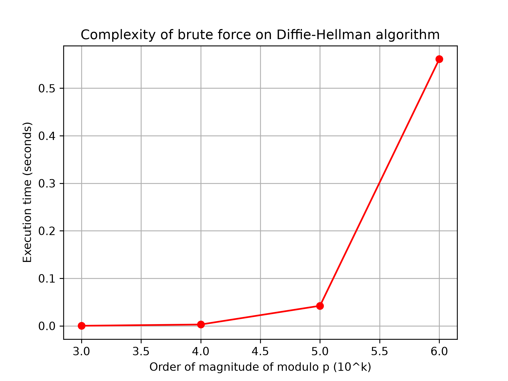

# Cryptanalysis of the Diffie-Hellman Key Exchange

To summarize, this project is a study and a benchmarking of the security of the Diffie-Hellman key exchange protocol.

To explain simply the mathematics behind the Diffie-Hellman protocol, its security is based on the difficulty of solving the **Discrete Logarithm Problem (DLP)** on finite fields.

This project explains different ways to bypass this problem, ranging from simple and naive methods to advanced Red Teaming techniques. In this repository, you will find the code implementation, the mathematical applications, as well as the analysis, explanations, and benchmarking of each solution.

This repository is organized around each solution: first, an explanation of the problem, followed by different solutions with their respective explanations and benchmarks.

## 1. The Problem

First, let's explain the problem from a mathematical perspective.

The Diffie-Hellman key exchange protocol provides a way to establish a shared secret key ($K$) between two people (Alice and Bob) who want to secure their communication over an insecure public network.

1. Alice and Bob agree on two public parameters:
   - A large prime number $p$.
   - A generator $g$ (a primitive root modulo $p$).
2. Alice chooses a secret private number $a$, and Bob chooses a secret private number $b$.
3. They compute their public values:
   $$A = g^a \pmod p$$
   $$B = g^b \pmod p$$
4. They exchange $A$ and $B$ over the public network.
5. Finally, they compute the shared secret key $K$:
   $$K_a = B^a \pmod p$$
   $$K_b = A^b \pmod p$$

They obtain the exact same key $K$ because:
$$K = K_a = (g^b)^a \equiv g^{a \cdot b} \equiv (g^a)^b = K_b \pmod p$$

Moreover, an eavesdropper (Eve) listening to the network knows $p$, $g$, $A$, and $B$. To recover the secret exponent $x$, Eve needs to solve the following equation:

$$g^x \equiv A \pmod p$$

This is the **Discrete Logarithm Problem (DLP)** over finite fields.

## 2. Solution 1: Naive Brute-Force Attack

The easiest and most naive way to solve this problem is to try every possible value of $x$ sequentially.

Below is the benchmark graph showing execution time as a function of the order of magnitude of $p$ (number of digits):

### Complexity Analysis:
- **With respect to $p$:** The time complexity is **linear** $\mathcal{O}(p)$.
- **With respect to key size (number of digits $k$ of $p$):** The time complexity is **exponential** $\mathcal{O}(10^k)$.

As shown on the graph, adding just a few digits to $p$ causes the execution time to explode. If $p$ is sufficiently large, a naive brute-force attack would take decades or centuries to find $x$.